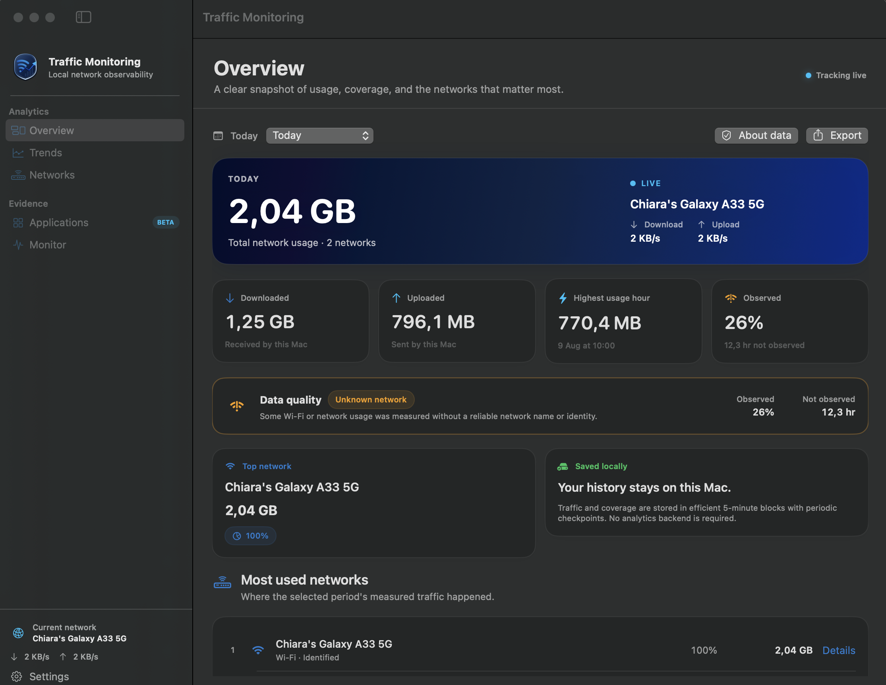
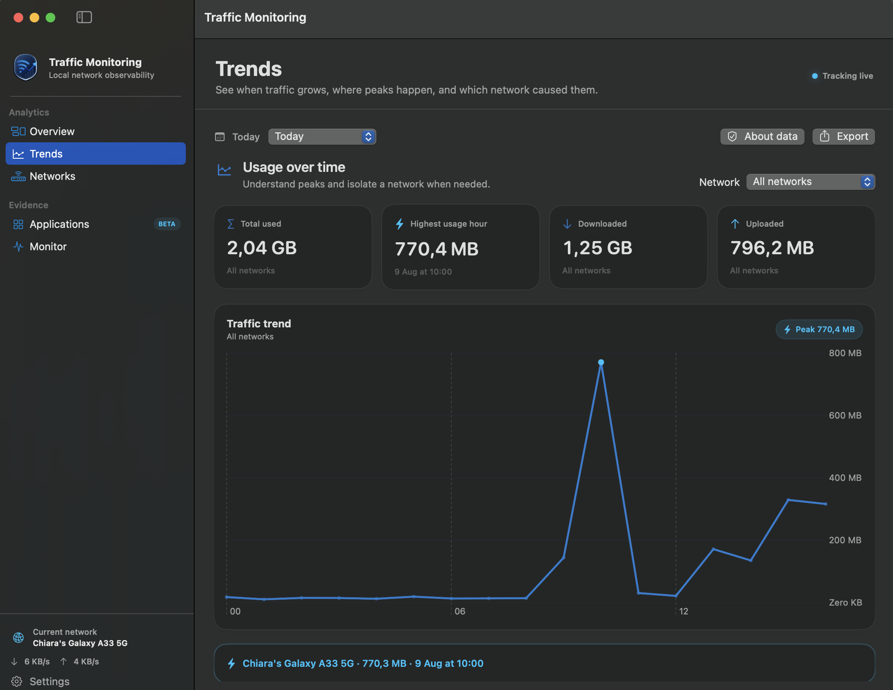
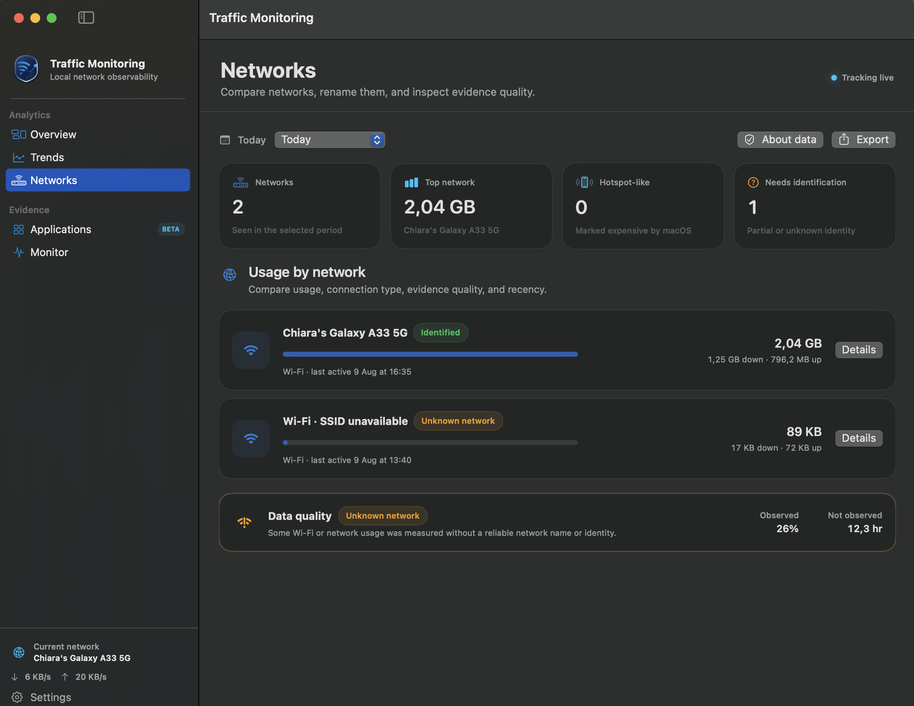
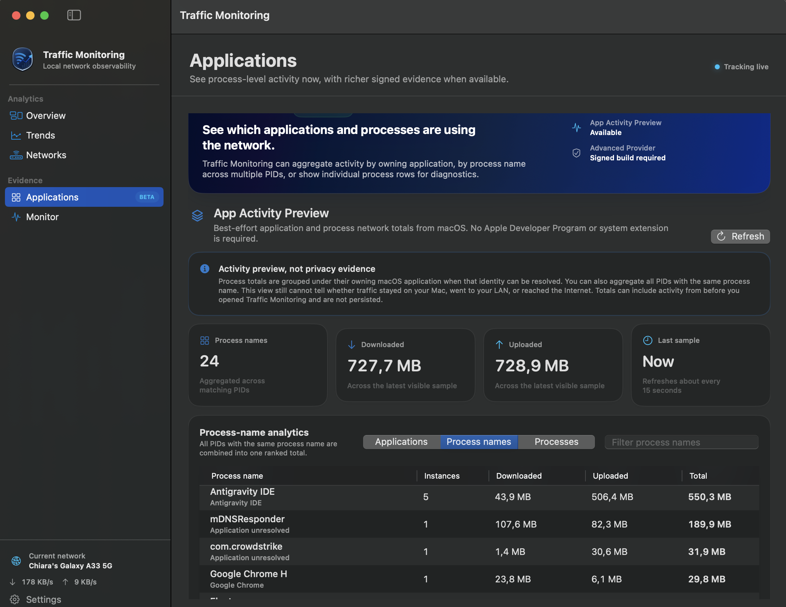
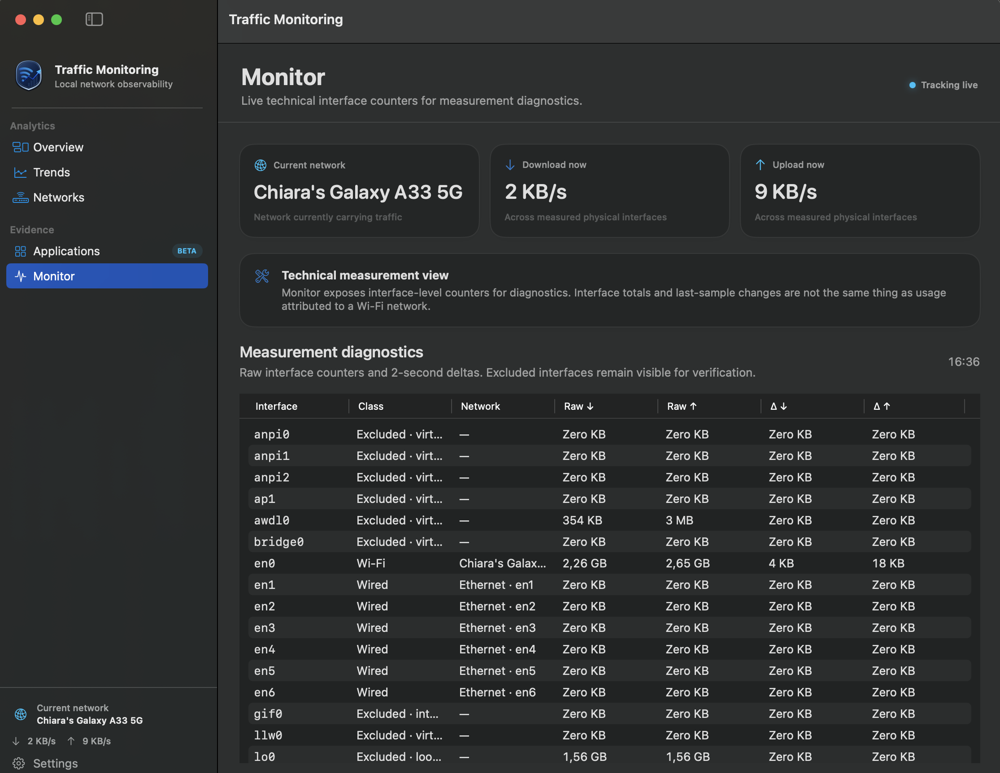
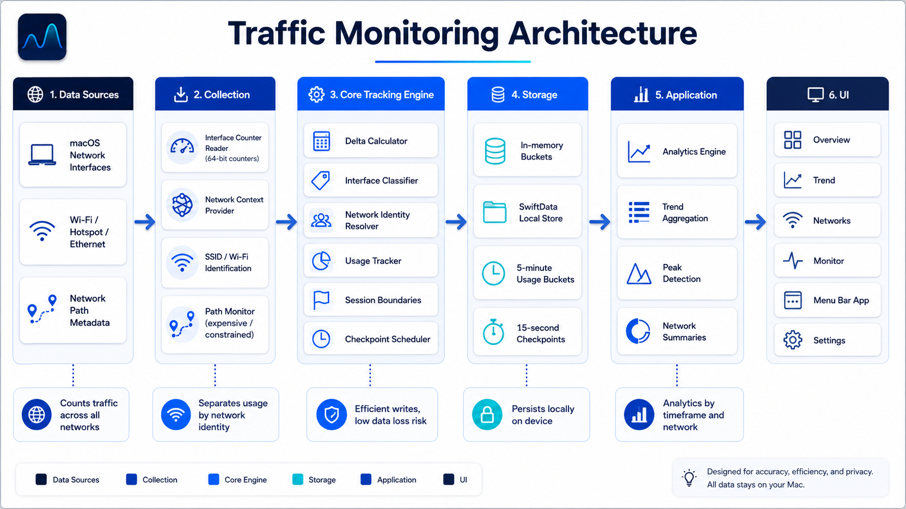

<p align="center">
  
</p>

<h1 align="center">Traffic Monitoring</h1>

<p align="center">
  <strong>Local Network Observability for macOS</strong><br>
  Measure what moves. Understand where it moves.<br>
  A privacy-first network evidence tool for understanding device traffic today and progressively validating local-first software behavior.
</p>

<p align="center">
  <a href="https://daniele21.github.io/">Mission</a> ·
  <a href="#network-evidence-vision">Vision</a> ·
  <a href="#values-and-opportunities">Opportunities</a> ·
  <a href="#where-we-are-today">Today</a> ·
  <a href="#how-it-works">Architecture</a> ·
  <a href="#run-it">Run it</a> ·
  <a href="#evidence-and-maturity">Evidence</a>
</p>

<p align="center">
  <a href="https://github.com/daniele21/traffic-monitoring/actions/workflows/ci.yml"></a>
  
  
  
</p>

## Why this exists

My broader mission is to [build infrastructure for product-grade local AI](https://daniele21.github.io/): local-first architectures should give products more control over runtime, data, cost, and model lifecycle without pretending the cloud is always wrong or local execution is always sufficient.

That control comes with responsibility. If a product says that sensitive work stays on a user-owned device, teams need more than a privacy claim: they need **observability, measurable boundaries, and evidence that reflects what was actually observed**.

Traffic Monitoring focuses on the network side of that problem.

It started from a simple practical question:

> **How much data am I actually using when my Mac connects through my phone hotspot?**

The useful answer turned out to require more than a counter. A trustworthy tool also needs to know which network context produced the traffic, how much of a period was actually observed, when network identity was incomplete, and which conclusions the data does — and does not — support.

The project is therefore evolving from a lightweight usage monitor into a reusable **Evidence & Observability** layer for local-first software while keeping the original utility useful on its own.

The end state is intentionally not a packet sniffer and not an AI runtime:

- everyday users can understand network usage across Wi-Fi, hotspot, Ethernet, and time;
- developers can inspect best-effort application activity without installing a privileged component;
- richer signed application-flow evidence can remain a separately gated capability;
- future privacy-validation workflows are allowed only when the underlying evidence is strong enough to support them;
- packet payloads, browsing content, and raw user data do not become the price of observability.

## Values and opportunities

Traffic Monitoring is designed around values that make local-first systems more understandable without turning network observability into surveillance.

| Value | What it means | Opportunity it creates |
| --- | --- | --- |
| **Local-first control** | Usage history, analytics, aliases, and preview data stay on the Mac unless the user explicitly exports evidence | Useful network analytics without creating another cloud telemetry dependency |
| **Evidence over claims** | Traffic totals are paired with observation coverage, identity quality, explicit gaps, and known limitations | Teams can distinguish what was measured from what is merely assumed |
| **Observe, don't inspect** | The core works from counters and metadata; app preview uses process summaries; the advanced prototype exchanges aggregates rather than payloads | Network behavior can become visible without retaining browsing or message content |
| **Unknown is valid** | Unknown network, unknown application, degraded coverage, and unvalidated byte accounting remain explicit states | Incomplete evidence does not become a false privacy conclusion |
| **Useful without privileges** | Core analytics and App Activity Preview do not depend on a paid Apple Developer Program or an installed Network Extension | The repository remains useful to ordinary Mac users and open-source contributors |
| **Gated advanced capability** | Privileged application-flow evidence stays separate from the lightweight tracker and requires its own validation | More powerful observability can evolve without making the base product fragile or invasive |

This creates several practical opportunities:

- **For Mac users:** understand hotspot consumption, network history, download/upload balance, peaks, and which networks account for usage.
- **For privacy-conscious users:** keep network analytics local and inspect measurement quality instead of trusting opaque cloud telemetry.
- **For local-first developers:** get a lightweight application-activity view today and a path toward stronger network evidence later.
- **For product teams:** document observed network behavior alongside local-first architecture decisions and validation work.
- **For open-source engineering:** explore how far useful observability can go with public, non-privileged macOS capabilities before accepting privileged deployment complexity.

## Network evidence vision

The target product is a **local network evidence layer for macOS**: one tool that can move from device-level usage visibility toward progressively stronger application-level evidence while keeping each evidence level explicit.

The target architecture has three deliberately different capability tiers:

```text
Traffic Monitoring
│
├── Core network evidence
│   ├── physical-interface counters
│   ├── network identity and path metadata
│   ├── historical usage and observation coverage
│   └── reproducible aggregate export
│
├── App Activity Preview
│   ├── no privileged installation
│   ├── application and process activity grouping
│   ├── cumulative process byte summaries
│   └── no locality or privacy verdict
│
└── Advanced Provider
    ├── optional signed Network Extension system extension
    ├── source-application identity
    ├── Local / External / Unknown flow classification
    ├── experimental byte accounting
    └── future audit evidence only after real-device validation
```

The distinction matters. A physical-interface counter can prove that bytes crossed an interface; it cannot prove which application produced them. A process summary can show app activity; it cannot prove whether those bytes were loopback, LAN, or Internet traffic. A future audit must therefore inherit the limitations of the exact evidence source rather than hide them.

## Strategy: from traffic counter to evidence layer

The strategy is to strengthen evidence quality before making stronger privacy claims.

Each stage remains useful on its own:

1. **Measure the network correctly:** use stable 64-bit physical-interface counters, avoid VPN double counting, and attribute deltas to the network context that produced them.
2. **Make the measurement explainable:** persist aggregate history, record observation coverage, surface unknown identity, and export reproducible network evidence.
3. **Add application visibility without privilege:** use a local macOS process-summary source as a best-effort preview and aggregate helper processes into application-level rows when macOS metadata allows it.
4. **Gate richer flow evidence:** keep Network Extension application/locality evidence optional, signed, and independent from the core tracker.
5. **Earn audit semantics:** only introduce privacy-audit or regression-test conclusions after source identity, locality, coverage, byte accounting, helper processes, VPN behavior, and performance are validated on real Macs.

This is the same engineering principle behind the broader local-first mission: **running something locally is only the beginning; operating it reliably and observably is the real product work.**

## Where we are today

**Traffic Monitoring is currently a tangible local network observability app for macOS.** The core network evidence path and non-privileged application preview are usable today. The signed Advanced Provider is implemented as a prototype but is not release-validated.

The current app lets a user or developer:

- measure download/upload continuously from physical macOS network interfaces using 64-bit Darwin counters;
- attribute traffic to Wi-Fi, Personal Hotspot, Ethernet, and supported physical network contexts;
- enrich Wi-Fi identity with SSID when macOS Location permission allows it, while continuing to count traffic when permission is denied;
- inspect Today / 7 days / 30 days / This month / All time / Custom historical ranges;
- compare networks, inspect trends and peaks, assign friendly aliases, and drill into network detail;
- inspect **observation coverage** and evidence quality instead of assuming an entire selected period was monitored;
- preview and save versioned JSON / CSV aggregate network evidence;
- inspect **Applications Beta** without privileged installation;
- view application-level activity totals by aggregating multiple related processes when macOS application metadata makes that relationship observable;
- switch to process-level detail when PID-level diagnostics are useful;
- keep richer Local / External / Unknown application-flow evidence behind the separately gated Advanced Provider path.

> **Current boundary:** App Activity Preview is best-effort activity visibility, not privacy evidence. Its process totals can include activity from before Traffic Monitoring opened, and it cannot determine whether traffic stayed on the Mac, reached the LAN, or reached the public Internet. The signed Advanced Provider must not be treated as validated merely because its source, build, packaging, and IPC gates pass in CI.

The main product surfaces are organized around the questions a user is trying to answer:

| Surface | Primary question |
| --- | --- |
| **Overview** | How much network traffic did this Mac use in the selected period, and how trustworthy is the observation coverage? |
| **Trends** | When did traffic happen, where were the peaks, and how did networks compare over time? |
| **Networks** | Which network contexts accounted for usage, and what do we know about each one? |
| **Applications Beta** | Which applications/processes show network activity right now, and what evidence level is available? |
| **Monitor** | What are the underlying interface counters and last-sample diagnostics? |
| **Settings** | How are Wi-Fi identity, local storage, App Activity Preview, and the optional Advanced Provider configured? |

### Product surfaces in action

#### 1. Overview Dashboard
A high-level snapshot of total usage, download/upload breakdown, observation coverage, data quality, and top network contexts:
<p align="center">
  
</p>

#### 2. Trends Analytics
Time-series bandwidth breakdown with peak traffic detection, hourly analysis, and network isolation:
<p align="center">
  
</p>

#### 3. Networks Breakdown
Comparative analysis across Wi-Fi networks, mobile hotspots, and Ethernet interfaces with identity classification and evidence quality indicators:
<p align="center">
  
</p>

#### 4. Applications (Beta)
Non-privileged process network activity summary (`nettop`) aggregated by macOS application bundle, process name, or individual PID:
<p align="center">
  
</p>

#### 5. Technical Monitor
Real-time interface counter readings, raw 64-bit Darwin kernel byte statistics, and 2-second delta measurement diagnostics:
<p align="center">
  
</p>


### Core network evidence

Traffic Monitoring keeps usage and evidence quality separate:

```text
Observed usage
    +
Observation coverage
    +
Network identity quality
    =
Network-level evidence
```

Core evidence states include:

- **Identified** — the observed network context is identified and there are no known gaps for the interval;
- **Partially identified** — some time was not observed or some usage used weaker metadata;
- **Unknown network** — traffic was measured but a reliable Wi-Fi/network identity was unavailable;
- **Tracking degraded** — a counter, persistence, or observation problem affected part of the evidence.

Sleep, app shutdown, crashes, and long observation gaps are not silently filled in as monitored time.

### App Activity Preview — available without Apple Developer Program

The lightweight Applications path samples the local macOS process network summary and shows best-effort:

- application name when it can be resolved;
- bundle identifier when available;
- number of contributing processes;
- downloaded bytes;
- uploaded bytes;
- total bytes;
- underlying process/PID detail;
- latest preview refresh.

Traffic Monitoring attempts to resolve each sampled PID to its owning macOS application and may follow parent-process relationships to group helper processes under the application that owns them. When the owner cannot be determined reliably, the row remains a best-effort process group rather than inventing application identity.

This path uses the local macOS `nettop` process-summary interface and does **not** require a Network Extension, system-extension installation, Developer ID, or Apple Developer Program membership.

It remains intentionally separate from network evidence export and cannot establish Local / LAN / Internet locality or a `local-only` verdict.

See [`docs/non-privileged-app-activity.md`](docs/non-privileged-app-activity.md).

### Advanced Provider — experimental signed path

The repository also contains the B0/B1/B2 prototype for richer application-flow evidence:

- embedded macOS `NEFilterDataProvider` system-extension target;
- source application resolution from the macOS audit-token path with explicit `Unknown application` fallback;
- deterministic loopback / local-network / external / unknown classification;
- low-frequency flow statistics with byte accounting still marked **Not validated**;
- authenticated provider → app Mach/XPC aggregate bridge;
- provider lifecycle, approval/configuration states, and local runtime diagnostics;
- Applications provider table/detail when signed evidence exists.

All source/build/package gates pass in CI, but runtime activation requires Apple signing/capabilities and representative real-Mac validation.

The normal downloadable ad-hoc CI build detects the missing entitlement and presents the capability as **Signed build required** instead of pretending the provider is broken or active.

See:

- [`docs/b0-b2-implementation-status.md`](docs/b0-b2-implementation-status.md)
- [`docs/advanced-observability-feasibility.md`](docs/advanced-observability-feasibility.md)
- [`docs/advanced-observability-signed-runbook.md`](docs/advanced-observability-signed-runbook.md)

## How it works

<p align="center">
  
</p>

The architecture of **Traffic Monitoring** is organized into three distinct data paths that isolate low-level system sources, tracking business logic, local persistence, and user-facing product surfaces.

### Architectural Breakdown

#### 1. macOS Data Sources (`macOS Sources`)
Low-level macOS APIs and toolings feeding context and measurements into the system:

- **`Network.framework`** ([`AppleNetworkContextProvider.swift`](TrafficMonitoring/Platform/AppleNetworkContextProvider.swift)): Monitors interface state transitions and network traits via `NWPathMonitor` (e.g., detecting cellular hotspots or constrained connections).
- **`CoreWLAN + Location`** ([`WiFiContextProvider.swift`](TrafficMonitoring/Platform/WiFiContextProvider.swift), [`LocationAuthorizationController.swift`](TrafficMonitoring/Platform/LocationAuthorizationController.swift)): Retrieves Wi-Fi SSID and interface details when Location permission is granted. Gracefully degrades to anonymous Wi-Fi identity when permission is restricted.
- **`Darwin sysctl`** ([`DarwinInterfaceCounterReader.swift`](TrafficMonitoring/Platform/DarwinInterfaceCounterReader.swift)): Direct 64-bit kernel interface statistics (`if_data64`, RX/TX byte totals) fetched via BSD `sysctl` (`NET_RT_IFLIST2`) for accurate, hardware-level physical traffic counting.
- **`nettop`** ([`NettopProcessSampler.swift`](TrafficMonitoring/Tracking/NettopProcessSampler.swift)): Subprocess sampler running `nettop` in non-blocking CSV mode every ~15 seconds to sample system-wide process byte statistics for best-effort previewing.

---

#### 2. Core Network Evidence (`CURRENT` — Authoritative Path)
The primary production tracking engine (represented by the **solid green/blue path**):

- **Platform Adapters → Traffic Tracker**: [`TrafficTracker.swift`](TrafficMonitoring/Tracking/TrafficTracker.swift) (a thread-safe Swift actor) consumes platform adapter events and calculates delta bytes per physical interface using [`DeltaCalculator.swift`](TrafficMonitoring/Tracking/DeltaCalculator.swift). Interface resets or counter wrap-arounds are safely rejected.
- **Live State → In-Memory Accumulation**: Real-time traffic rates are tracked in [`SessionUsageAccumulator.swift`](TrafficMonitoring/Tracking/SessionUsageAccumulator.swift) and accumulated into memory via [`UsageBucketAccumulator.swift`](TrafficMonitoring/Tracking/UsageBucketAccumulator.swift).
- **5-Minute Buckets → SwiftData Local Store**: Deltas are compacted into 5-minute time windows (`UsageBucketEntity`) and checkpointed to local storage via [`SwiftDataUsageRepository.swift`](TrafficMonitoring/Persistence/SwiftDataUsageRepository.swift) approximately every 15 seconds.
- **Evidence Quality & Analytics Engine**: Tracks continuous observation coverage ([`ObservationCoverage.swift`](TrafficMonitoring/Domain/ObservationCoverage.swift)), identifying gaps from system sleep or reboots. Aggregated metrics feed into [`UsageAnalyticsAggregator.swift`](TrafficMonitoring/Tracking/UsageAnalyticsAggregator.swift) and [`EvidenceExportService.swift`](TrafficMonitoring/Tracking/EvidenceExportService.swift) for reproducible JSON/CSV evidence export.

---

#### 3. App Activity Preview (`BEST-EFFORT` — Non-Privileged Path)
Lightweight process attribution (represented by the **dashed cyan path**), operating completely without privileged developer entitlements:

- **Process Sampler (`nettop` every ~15s)**: [`NettopProcessSampler.swift`](TrafficMonitoring/Tracking/NettopProcessSampler.swift) captures snapshots of active network processes.
- **Parser + Resolver**: [`NettopProcessCSVParser.swift`](TrafficMonitoring/Tracking/NettopProcessCSVParser.swift) parses raw CSV samples, while [`AppMetadataResolver.swift`](TrafficMonitoring/Tracking/AppMetadataResolver.swift) maps process PIDs to macOS application bundles and resolves helper processes back to parent applications.
- **Three Aggregation Levels**: [`LightweightApplicationActivityAggregator.swift`](TrafficMonitoring/Tracking/LightweightApplicationActivityAggregator.swift) summarizes activity at three distinct granularities:
  1. **Applications**: Grouped by macOS application bundle identifier.
  2. **Process Names**: Grouped by executable binary name.
  3. **Processes / PID**: Granular per-process breakdown.
- **Boundary**: Purely best-effort activity visibility; kept separate from authoritative network evidence exports.

---

#### 4. Advanced Provider (`EXPERIMENTAL` — Signed System Extension Path)
Separately gated prototype for flow-level network evidence (represented by the **dashed amber path**):

- **`NEFilterDataProvider` System Extension**: Prototype located in [`experiments/advanced-observability/`](experiments/advanced-observability/). Uses macOS Content Filter APIs and Security Code Signing APIs (`sourceAppAuditToken`) for precise application identification.
- **Flow Evidence & Locality**: Evaluates flow locality (`Local`, `External`, `Unknown`) via [`IPLocalityClassifier.swift`](TrafficMonitoring/Tracking/IPLocalityClassifier.swift) without triggering DNS traffic.
- **Authenticated XPC**: Exposes aggregate flow evidence (JSON format only) to the main app via a secure Mach/XPC bridge declared by `NEMachServiceName`. Never sends packet payloads or raw audit tokens.

---

#### 5. Product Surfaces (`Product Surfaces`)
SwiftUI presentation layer located in [`TrafficMonitoring/Features/`](TrafficMonitoring/Features/):

- **Overview / Trends / Networks**: Driven by the authoritative Core Network Evidence path. Displays total bandwidth, peak usage, network comparison, and observation coverage.
- **Applications Beta** ([`ApplicationsView.swift`](TrafficMonitoring/Features/Applications/ApplicationsView.swift)): Displays per-application network attribution, combining data from both the Best-Effort App Preview (cyan path) and the Experimental Advanced Provider (amber path).
- **Monitor**: Live interface counter feed and real-time activity diagnostics.
- **Menu Bar / Settings**: Quick status via `MenuBarExtra`, user preferences, Wi-Fi permission toggles, and system extension lifecycle controls.

---

### Dependency & Privacy Architecture

The architectural dependency flow enforces strict separation:

```text
Platform Sources
    ↓
Tracking / Evidence Domain
    ↓
Local Aggregate Persistence
    ↓
Analytics / Application Activity Controllers
    ↓
SwiftUI Product Surfaces
```

- **Local-First Privacy Invariant**: All analytics and evidence remain **100% on-device**. No network telemetry or personal usage data is transmitted externally.
- **Independent Execution**: The core tracking engine functions continuously regardless of whether Wi-Fi SSID permissions are denied, App Activity Preview is disabled, or the Advanced Provider is absent.

For deeper technical details, refer to [`docs/architecture.md`](docs/architecture.md), [`docs/data-and-analytics.md`](docs/data-and-analytics.md), and [`docs/adr/0001-advanced-observability-content-filter.md`](docs/adr/0001-advanced-observability-content-filter.md).

## Repository map

| Area | Key paths | Responsibility |
| --- | --- | --- |
| App shell | `TrafficMonitoring/App` | App lifecycle, model composition, menu-bar entry point |
| Brand and product UI | `TrafficMonitoring/Brand`, `TrafficMonitoring/Features` | Native macOS information architecture, branded components, Analytics, Applications, Monitor, Settings |
| Domain | `TrafficMonitoring/Domain` | Network, evidence, analytics, export, application-activity, and Advanced Observability models |
| Core tracking | `TrafficMonitoring/Tracking` | Delta calculation, interface classification, usage aggregation, evidence export, `nettop` parsing |
| Platform | `TrafficMonitoring/Platform` | Darwin counters, Network.framework context, CoreWLAN, Location permission |
| Persistence | `TrafficMonitoring/Persistence` | SwiftData usage/coverage buckets, aliases, checkpointing, historical queries |
| Advanced prototype | `experiments/advanced-observability` | Network Extension provider, flow aggregation, signing-identity resolution, XPC bridge |
| Tests | `TrafficMonitoringCoreTests` | Counter, aggregation, coverage, export, locality, parser, app aggregation, persistence semantics |
| Product docs | `docs` | Positioning, UX, evidence contracts, architecture, implementation status, validation runbooks |

`project.yml` is the authoritative XcodeGen project definition. `Package.swift` exposes the platform-independent Domain/Tracking core to SwiftPM tests.

## Run it

### Without installing Xcode

The easiest development build is produced by GitHub Actions:

1. Open **Actions → CI**.
2. Open a successful run for the branch/commit you want to test.
3. Download the **TrafficMonitoring-macOS** artifact.
4. Unzip the artifact, then unzip `TrafficMonitoring.app.zip`.
5. Move `TrafficMonitoring.app` to Applications if desired and launch it.

The artifact is ad-hoc signed, not notarized. If macOS quarantine blocks the development build, follow [`docs/run-without-xcode.md`](docs/run-without-xcode.md).

Traffic Monitoring is an `LSUIElement` menu-bar app. After launch, look for its shield icon in the macOS menu bar.

The ad-hoc build supports the complete core product and App Activity Preview. It **cannot** activate the Advanced Provider because that path requires Apple system-extension/network-extension signing capabilities.

### Local development

Prerequisites:

- macOS 14+
- full Xcode installation for app builds/tests
- XcodeGen
- Swift toolchain compatible with the repository project

Generate the project:

```bash
brew install xcodegen
xcodegen generate
open TrafficMonitoring.xcodeproj
```

Run the `TrafficMonitoring` scheme.

Core deterministic tests can also run through SwiftPM:

```bash
swift test
```

## Evidence and maturity

Traffic Monitoring is an active observability and validation project, not a production network-forensics suite and not yet a privacy-audit engine.

The maturity level depends on the evidence source:

| Capability | Current maturity | Safe conclusion |
| --- | --- | --- |
| Physical-interface usage | Implemented and covered by automated tests; real-network acceptance remains relevant | Bytes were observed on a supported physical interface/network context while the app was observing |
| Historical network evidence | Implemented with coverage/identity quality and versioned export | Aggregate usage can be reproduced together with known observation limitations |
| App Activity Preview | Implemented, non-privileged, best-effort | These applications/processes appear in the latest macOS process network summary with these cumulative byte totals |
| Application grouping | Implemented as best-effort PID/application resolution | Multiple observed processes can be grouped under an owning macOS application when that relationship is observable |
| Advanced Provider | Source/build/package prototype passes CI | The architecture compiles/packages; signed runtime behavior is **not** proven by CI |
| Per-app locality / byte evidence | Experimental / not release-validated | No privacy verdict until controlled real-Mac reconciliation passes |
| Privacy Audit | Future only | No audit claim is currently supported |

Traffic Monitoring deliberately does **not** claim that core counters or App Activity Preview can tell:

- which remote destination received traffic;
- whether every application byte stayed local or reached the public Internet;
- that an application is `local-only`;
- exact ISP or mobile-carrier billing usage;
- complete activity during periods when the relevant evidence source was not observing.

The core measurement is physical-interface traffic. LAN/NAS traffic may therefore be included in totals. VPN virtual interfaces are excluded from the main physical counter path to avoid double counting, but VPN and helper-process behavior remains an important validation case for richer application evidence.

Use these sources for current truth:

- [Product contract](docs/product-spec.md)
- [A0–A2 evidence/export status](docs/a0-a2-implementation-status.md)
- [B0–B2 Advanced Provider status](docs/b0-b2-implementation-status.md)
- [Non-privileged App Activity Preview](docs/non-privileged-app-activity.md)
- [Evidence export contract](docs/evidence-export.md)
- [Testing and real-Mac validation](docs/testing.md)

## Build and validate

Run the narrowest checks for the area you change. The repository-wide CI gate generates the Xcode project, tests the platform-independent core, validates the non-privileged process-summary source, builds/tests the macOS app, builds the unsigned Advanced Observability spike, verifies the embedded system-extension structure, creates a clean Release app, and packages the runnable development artifact.

Core checks:

```bash
xcodegen generate
swift test
```

Representative app build/test gate:

```bash
xcodebuild \
  -project TrafficMonitoring.xcodeproj \
  -scheme TrafficMonitoring \
  -configuration Debug \
  -destination 'platform=macOS' \
  CODE_SIGNING_ALLOWED=NO \
  build test
```

Coding agents start from [`AGENTS.md`](AGENTS.md), which routes work through focused progressive-disclosure documentation instead of loading the entire repository context.

## Strategic role in the local-first stack

Traffic Monitoring is **supporting evidence infrastructure**, not a fourth AI runtime pillar.

```text
Product-grade local-first stack
│
├── Reusable AI infrastructure
│   ├── Local LLM Server
│   ├── Local ASR Server
│   └── Android Local LLM Harness
│
├── Reference applications
│   ├── ClosedRoom
│   ├── RedactGuard
│   └── Aura Finance
│
└── Evidence & observability
    └── Traffic Monitoring
```

The relationship is simple:

> **Local-first gives a product control. Observability helps make that control understandable and, where the platform allows it, verifiable.**

Traffic Monitoring therefore strengthens the broader mission without forcing AI into a project that does not need it.

## Documentation

Start small:

- [`AGENTS.md`](AGENTS.md) — invariants and progressive-disclosure routing
- [`docs/README.md`](docs/README.md) — documentation map
- [`docs/positioning.md`](docs/positioning.md) — ecosystem role and public narrative
- [`docs/product-spec.md`](docs/product-spec.md) — current product contract
- [`docs/brand.md`](docs/brand.md) — visual system
- [`docs/ux.md`](docs/ux.md) — product information architecture
- [`docs/data-and-analytics.md`](docs/data-and-analytics.md) — persistence, analytics, evidence coverage
- [`docs/non-privileged-app-activity.md`](docs/non-privileged-app-activity.md) — application preview boundary
- [`docs/evidence-export.md`](docs/evidence-export.md) — JSON/CSV evidence contract
- [`docs/b0-b2-implementation-status.md`](docs/b0-b2-implementation-status.md) — signed Advanced Provider status

## Author and mission

Traffic Monitoring is built by [Daniele Moltisanti](https://daniele21.github.io/) as part of an open exploration of **product-grade local-first architectures**: reusable infrastructure, privacy-aware observability, measurable evidence, and intuitive software running on user-owned hardware.

The project is developed in public alongside the broader local-first infrastructure and reference-application stack.